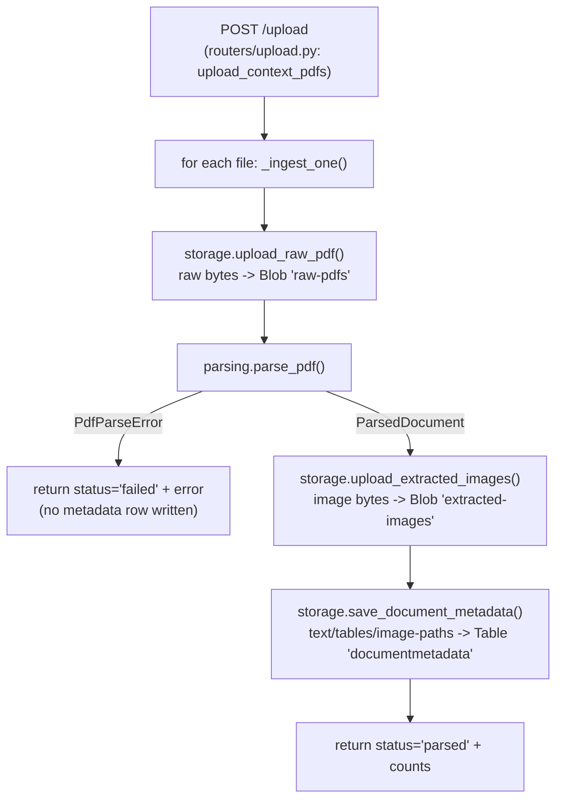
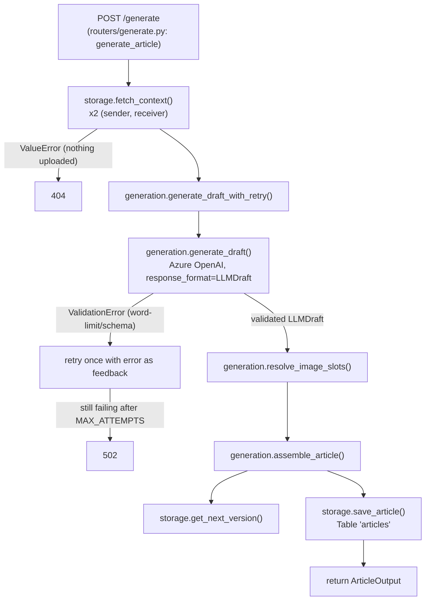
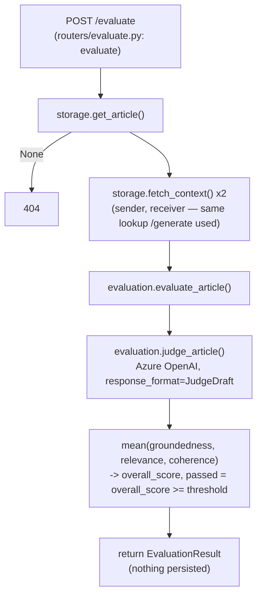

# Code Map

Living reference for how requests flow through the code — entry point, what
calls what, what each function takes in and hands back. Not the API contract
(that's `docs/architecture/api-payload-schemas.drawio`) — this is the internal call chain, for
following the code itself in VS Code. **Update this whenever a route's logic
changes meaningfully** — it's only useful if it stays in sync.

_Last updated: covers `/upload`, `/generate`, and `/evaluate`._

## POST /upload

### Request

Multipart form-data, not JSON (it carries files):

| field | type | notes |
|---|---|---|
| `sender_id` | str | **Caller-chosen, free text.** No registration step, no validity check — see the docstring on `upload_context_pdfs`. The same string reused across calls is what pairs documents together later. |
| `receiver_id` | str | Same idea, for the receiver side. |
| `role` | `"sender"` \| `"receiver"` | Which side *this* file belongs to. |
| `files` | one or more PDFs | Each ingested independently — one bad file doesn't fail the batch. |

### Step by step

1. **`upload_context_pdfs`** (`routers/upload.py`) — reads the form fields, loops over `files`, calls `_ingest_one()` per file, collects results into `UploadResponse`.
2. **`_ingest_one`** (`routers/upload.py`), per file:
   - `document_id = uuid4()` — random unique ID, unrelated to file content.
   - `content = await file.read()` — raw PDF bytes.
   - `storage.upload_raw_pdf(...)` — uploads `content` as-is to Blob container `raw-pdfs`, path `{sender_id}/{receiver_id}/{role}/{document_id}/{filename}`. Happens **before** parsing, so even an unparseable file is preserved for inspection/retry.
   - `parsing.parse_pdf(content, filename)` — see below. Returns a `ParsedDocument`, or raises `PdfParseError`.
     - On `PdfParseError`: build `DocumentIngestResult(status="failed", error=...)` and return immediately — no Table Storage row is written for a failed file.
   - `storage.upload_extracted_images(...)` — uploads each found image's raw bytes to Blob container `extracted-images`, one blob per image.
   - `storage.save_document_metadata(...)` — writes **one row** to Table `documentmetadata`: `PartitionKey = f"{sender_id}__{receiver_id}"`, `RowKey = str(document_id)`, plus the extracted text (string), tables (JSON-encoded string), and image blob *paths* (JSON-encoded list of strings — not the image bytes; those stay in Blob Storage).
   - Returns `DocumentIngestResult(status="parsed", pages_extracted=..., tables_extracted=..., images_extracted=...)`.

### `parsing.parse_pdf()` internals (`parsing.py`)

- **`_extract_text_and_tables(content)`** — pdfplumber opens the PDF from bytes (`io.BytesIO(content)`, since pdfplumber wants a file-like object, not raw bytes), walks every page:
  - `page.extract_text()` — text in reading order.
  - `page.extract_tables()` — a **layout heuristic** (ruled lines / aligned text gaps), not OCR, not an LLM, not markdown. Returns each table as a list of rows, each row a list of cell strings.
  - Returns `(full_text, tables, page_count)`.
- **`_extract_images(content, filename)`** — PyMuPDF (`fitz`) opens the same bytes, walks every page:
  - `page.get_images(full=True)` — lists every embedded raster image on that page as a tuple; `img[0]` is the image's **xref** (a pointer into the PDF's internal object table, not the image data).
  - `doc.extract_image(xref)` — follows that pointer, returns the image's **actual decoded file bytes** (real PNG/JPEG bytes — not base64, not markdown) plus its extension.
  - Wraps each as an `ExtractedImage(filename, content, page_number)`.
- Both extraction steps run inside `parse_pdf()`'s `try/except` — any failure becomes a `PdfParseError`, caught by the router.

### Where data actually ends up in Azure

**Nothing uploads automatically** — the mock PDFs in `sample_data/` are just local files until you POST one to `/upload`. After a successful call:

- Blob container `raw-pdfs` → the original PDF.
- Blob container `extracted-images` → one blob per image found inside it.
- Table `documentmetadata` → one row, with text/tables inline and image blob-path references.

## POST /generate

### Request

JSON body (`GenerateRequest`):

| field | type | notes |
|---|---|---|
| `sender_id` | str | Must match a prior `/upload` call with `role="sender"`. |
| `receiver_id` | str | Must match a prior `/upload` call with `role="receiver"`. |
| `theme` | `ThemeColors` | `primary_color`/`secondary_color`/`accent_color`, 6-digit hex. Caller-supplied, echoed back into the response — the LLM never sees or writes these. |
| `feedback` | str \| null | Optional. Same shape as a future `/evaluate` response's `feedback` field — this endpoint never calls `/evaluate` itself, it just accepts feedback back in for a regenerate round trip. |

### Step by step

1. **`generate_article`** (`routers/generate.py`) — the whole handler. Looks up both sides' context, generates + validates a draft, resolves image slots, assembles and persists the final `ArticleOutput`.
2. **`storage.fetch_context(sender_id, receiver_id, role)`** — Table Storage query by `PartitionKey = f"{sender_id}__{receiver_id}"` and `role`, merged into one context dict (`text`, `tables`, `image_paths`). Deduplicates by exact text match (re-uploading the same PDF creates a second row). Raises `ValueError` → `404` if nothing was uploaded for that role.
3. **`generation.generate_draft_with_retry`** → **`generation.generate_draft`** — builds the system + user prompt (`build_user_prompt`, labeled SENDER/RECEIVER CONTEXT blocks — this labeling is the actual domain-bridging mechanism, not just a system-prompt instruction), calls Azure OpenAI's structured-output mode with `response_format=LLMDraft`, and returns the parsed draft. Azure OpenAI's structured output already guarantees the *shape* (required fields, 2-3 body sections); it has no word-count primitive, so `LLMDraft`'s Pydantic validators catch limit violations after the fact. On a `ValidationError`, the error is fed back to the model as extra instruction for **one retry** (`MAX_ATTEMPTS=2`); still failing after that raises `RuntimeError` → `502`.
4. **`generation.resolve_image_slots`** — builds the 3 fixed slots (`logo_sender`, `logo_receiver`, `hero_contextual`) in template order. Logo `blob_path`s come from the first image extracted from each side's uploaded PDFs (no vision model). `hero_contextual`'s `blob_path` is `None` — known gap, no contextual image source is ingested anywhere in this pipeline.
5. **`generation.assemble_article`** — combines `LLMDraft` (LLM-authored fields), `GenerateRequest` (`sender_id`/`receiver_id`/`theme`, echoed), and freshly computed values (`article_id`, `version` via `storage.get_next_version`, `total_word_count`, `created_at`) into the full `ArticleOutput`. `total_word_count`'s 300-600 target is a soft check — logged as a warning, not enforced.
6. **`storage.save_article`** — upserts one row into Table `articles`, keyed the same way as `documentmetadata` (`PartitionKey = f"{sender_id}__{receiver_id}"`, `RowKey = str(article_id)`), storing the entire `ArticleOutput` as one JSON string.

### Where data actually ends up in Azure

- Table `articles` → one row per generated article (JSON blob + version), same Storage Account as everything else. Created empty on startup alongside `documentmetadata`.
- No new Blob containers — `/generate` only *reads* blob paths already written by `/upload`; it doesn't write any new blobs itself.

Both Blob containers and the Table are created empty on app startup (`storage.ensure_resources_exist()`) if they don't already exist — that's provisioning empty structure, not data.

## POST /evaluate

### Request

JSON body (`EvaluateRequest`): just `article_id` (UUID) — same body-model convention as `/generate` and `/revise`, not a query param.

### Step by step

1. **`evaluate`** (`routers/evaluate.py`) — the whole handler. Looks up the article, re-fetches its original sender/receiver context, calls `evaluation.evaluate_article()`, returns the result. Writes nothing to storage.
2. **`storage.get_article(article_id)`** — the same cross-partition lookup `/revise` already uses. 404 if `article_id` doesn't match anything.
3. **`storage.fetch_context(article.sender_id, article.receiver_id, role=...)` x2** — the exact same context `/generate` originally used to write this article, re-fetched fresh (not cached anywhere) so the judge scores groundedness against real source material.
4. **`evaluation.judge_article`** (`app/evaluation.py` — its own file, not part of `generation.py`, mirroring the parsing.py/generation.py/pdf_export.py one-file-per-stage pattern; imports `get_client`/`format_context_for_prompt` from `generation.py` rather than duplicating them) — builds a labeled SENDER CONTEXT / RECEIVER CONTEXT / ARTICLE TO REVIEW prompt (`build_judge_prompt`) and calls Azure OpenAI's structured-output mode with `response_format=JudgeDraft` (three 0-1 scores + one feedback paragraph). No retry loop — `JudgeDraft`'s only constraints are `Field(ge=0, le=1)`, already enforced by structured-output mode's JSON Schema, so there's no post-hoc Pydantic failure mode like `LLMDraft`'s word-count validators have.
5. **`evaluation.evaluate_article`** — `overall_score = mean(groundedness, relevance, coherence)`, deliberately not weighted (decision-log.md §9a) — the UI shows all three alongside the mean rather than collapsing the fusion choice into one hidden number. `passed = overall_score >= settings.evaluation_pass_threshold` (default 0.75, env-overridable).
6. No deterministic word-limit/schema re-check — `ArticleOutput`'s fields are already Pydantic-validated at generate/revise time; re-checking here would repeat that work, not catch anything new (decision-log.md §9a).

### Where data actually ends up in Azure

Nowhere new. `/evaluate` only *reads* (an existing `articles` row via `get_article`, existing `documentmetadata` rows via `fetch_context`) — it writes no new Blob, Table, or row anywhere. Every call re-evaluates from scratch; nothing is cached or persisted (limitations.md).

### Frontend (demo/index.html)

Evaluation panel sits to the right of the rendered article (`.article-and-eval` flex row, stacks under it on narrow screens). "Evaluate" button calls `POST /evaluate` with `{article_id: lastArticle.article_id}` and renders the three score bars + overall pass/fail badge + feedback text. "Regenerate with this feedback" button fills the existing Generate form (sender_id/receiver_id/theme taken from the just-evaluated article, not whatever the form currently holds — see `regenerateWithFeedback()`) with `feedback: lastEvaluation.feedback` and submits the unchanged `/generate` flow. Nothing here calls `/generate` or `/evaluate` automatically — both button clicks are explicit user actions, decoupled per decision-log.md §9a.
